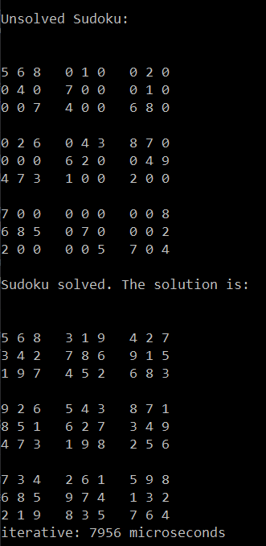

# Sudoku Solver

Dieses Programm löst ein Sudoko (fast) beliebiger Größe. Dazu wird eine Textdatei eingelesen, in der das ungelöste Sudoku gespeichert ist. Die Zahlen werden durch Kommata, Tabs oder Zeilenumbrüchen getrennt, sodass das Sudoku in der Datei optisch nachgebildet werden kann. Leere Felder werden durch eine 0 kodiert.

Der Solver ließt die Datei ein und extrahiert mit Hilfe von regulären Ausdrücken alle Zahlen.
Sind passend viele Zahlen vorhanden (bei einem klassischen Sudoku mit den Zahlen von 1 bis 9 müssen 81 Zahlen gegeben sein), versucht der Solver das Sudoku zu lösen. Konnte eine Lösung gefunden werden, wird diese ausgegeben. Konnte keine Lösung gefunden werden, wird ein entsprechender Text ausgegeben. Zudem wird angezeigt, wie viel Zeit der Solver zur Lösung des Sudokus benötigt hat.

## Lösung des Sudokus
Zu Beginn speichert der Solver alle leeren Felder in einer Liste. Anschließend setzt der Solver in das erste leere Feld den kleinsten möglichen Wert und geht dann zum nächsten leeren Feld, in das er erneut (falls möglich) den kleinsten möglichen Wert setzt. Der Solver sei nun am i. leeren Feld angekommen und versucht den kleinstmöglichen Wert zu setzen. Wurde ein solcher Wert gefunden, geht der Solver zum nächsten leeren Feld. Gibt es kein nächstes leeres Feld, ist das Sudoku gelöst. Konnte allerdings kein Wert gefunden werden, kann keine Lösung existieren. Nun gibt es zwei Möglichkeiten. 
1. Ist das aktuelle Feld das erste leere Feld, so existiert keine Lösung für das Sudoku. 
2. Ist das aktuelle Feld nicht das erste leere Feld, so geht der Solver zum voherigen leeren Feld zurück und versucht dort die nächst größere Zahl zu finden.
Dieser Vorgang wird so lange wiederholt, bis der Solver einen Wert für das letzte leere Element gefunden hat (das Sudoku wurde gelöst), oder kein Wert für das erste leere Element gefunden werden kann (das Sudoku hat keine Lösung).
Da der Solver nur zum nächsten oder vorherigen leeren Feld springt, ist die Liste die passende Datenstruktur zum Speichern der leeren Felder.

Zudem wurde ein rekursiver Solver entwickelt. Dieser geht sehr ähnlich vor: Der solver setzt in das aktuelle leere Feld die kleinstmögliche Zahl und ruft sich selbst auf. Gibt es keine solche Zahl, gibt er false zurück. Als ungelöstes Sudoku wird dann das bislang gelöste Sudoku übergeben.

## Installation und Ausführung
Das Programm Sudoku.exe befindet sich im Ordner Sudoku->x64->Release

Nachdem die Datei heruntergeladen wurde, kann sie mit der Konsole ausgeführt werden. Beispiel-Sudokus können im Ornder examples gefunden werden.

Der Quellcode befindet sich im Ordner Sudoku.

Das Programm wird in der Konsole mit dem Befehl 

Sudoku.exe Sudoku.txt 

aufgerufen, wenn die Datei Sudoku.txt das ungelöste Sudoku enthält. Wird keine Datei angegeben, wird automatisch die Datei Sudoku.txt verwendet.

Bemerkung: Bei der Lösung werden auch die vom Solver benötigten Zeiten mit angegeben. Interessanterweise, benötigt der iterative Löser länger, als der rekursive Löser. Dies hängt allerdings mit der Reihenfolge der Solver zusammen. Wird der iterative Löser zuerst aufgerufen, benötigt der rekursive Löser länger. Vermutlich hängt dies mit dem Betriebsystem zusammen.
Zudem ist interessant, dass der Solver auf dem Windowsrechner länger braucht als auf dem Ubuntu in der virtual box.

##Beispiel
3x3 Sudoku:

Copyright (C) 2024 Michael